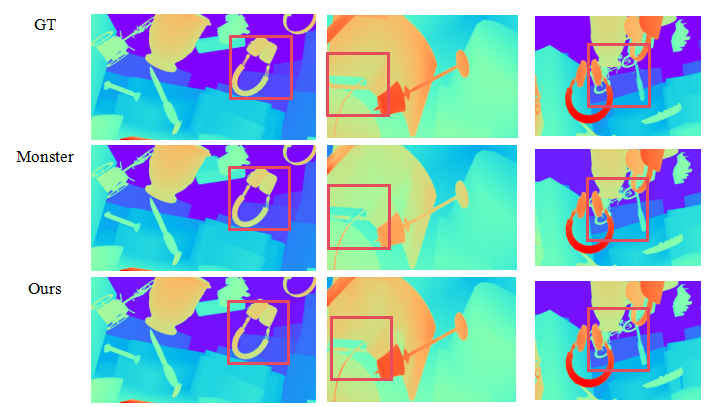

# 🚀 SyDE-Net 


> **SyDE-Net: Synergistic Disparity Estimation Network for Stereo Matching**
>
SyDE-Net targets the accuracy and robustness bottlenecks that persist in untextured regions, repetitive patterns, and occlusions by proposing a monocular-binaural collaborative stereo disparity estimation framework. The key idea is to complement global structural priors from monocular depth estimation with precise geometric constraints from stereo matching, preserving both global consistency and local details.

---

## ✨ Highlights
- **Semantic-geometric decoupling:** Channel attention emphasizes high-level semantics in the monocular branch, while spatial attention focuses the stereo branch on low-level geometric details.
- **Multi-scale iterative refinement:** A multi-scale ConvGRU updater continuously fuses contextual and geometric cues to repair occlusions and fine structures.
- **Cross-modal fusion:** The monocular branch supplies global structural priors and the stereo branch performs precise geometric correction, mitigating uncertainty in pathological regions.

---
## 🎨 Framework

---
## ⚙️ Environment Setup
- Recommended GPU: NVIDIA RTX 3090 (≥24GB)
- Python 3.8
- PyTorch 2.0.1 + CUDA 11.8
---
```bash
conda create -n sydenet python=3.8
conda activate sydenet
pip install torch==2.0.1 torchvision==0.15.2 torchaudio==2.0.2 --index-url https://download.pytorch.org/whl/cu118
pip install tqdm scipy opencv-python scikit-image tensorboard matplotlib timm==0.6.13
pip install mmcv==2.1.0 -f https://download.openmmlab.com/mmcv/dist/cu118/torch2.1/index.html
pip install accelerate==1.0.1 gradio==4.29.0 gradio_imageslider
```

---

## 📂 Data Preparation
Please extract each dataset to the path specified in `configs/datasets/*.yaml`:

| Dataset | Link                                                                                |
|---------|-------------------------------------------------------------------------------------|
| SceneFlow | https://lmb.informatik.uni-freiburg.de/resources/datasets/SceneFlowDatasets.en.html |
| SCARED| https://endovissub2019-scared.grand-challenge.org)                                  |


---

## 🧪 Evaluation

```bash
# SceneFlow 
python evaluate_stereo.py \
  --restore_ckpt ./pretrained/sceneflow.pth \
  --dataset <sceneflow>
```

---

## 🏋️ Training
```bash
CUDA_VISIBLE_DEVICES=0,1 accelerate launch train_sceneflow.py
CUDA_VISIBLE_DEVICES=0,1 accelerate launch train_scared.py

```

`train_scared.py` demonstrates how to train on the SCARED dataset and supports both list-based and built-in loading modes.

---

## 📊 Results

### SceneFlow Quantitative Evaluation


---

## 🙏 Contact
If you have any specific questions or need further assistance with the code, feel free to reach out via issues or email.
